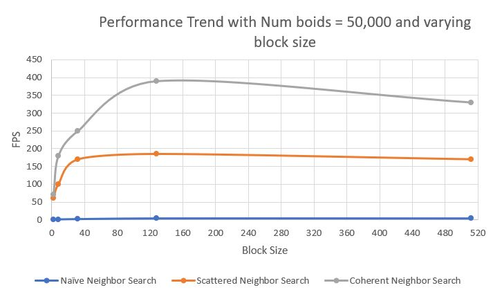

**University of Pennsylvania, CIS 565: GPU Programming and Architecture,
Project 1 - Flocking**

* Dewang Sultania
  * [LinkedIn](https://www.linkedin.com/in/dewang-sultania)
* Tested on: Windows 10, Intel Xeon E-2176M @ 2.70GHz 16GB, Quadro P2000 4GB (Personal Computer)
* Cuda Compute Capability: 6.1


## Boids with Naive Neighbor Search

In the Boids flocking simulation, particles representing boids move around in simulation space according to three rules:
- cohesion - boids move towards the perceived center of mass of their neighbors
- separation - boids avoid getting to close to their neighbors 
- alignment - boids generally try to move with the same direction and speed as their neighbors

These three rules specify a boid's velocity change in a timestep . At every timestep, a boid thus has to look at each of its neighboring boids and compute the velocity change contribution from each of the three rules. Thus, a bare-bones boids implementation has each boid check every other boid in the simulation.  The following is the pseudocode for the rules:

#### Rule 1: Boids try to fly towards the centre of mass of neighbouring boids

```
function rule1_adhesion(Boid boid)

    Vector perceived_center

    foreach Boid b:
        if b != boid and distance(b, boid) < rule1Distance then
            perceived_center += b.position
        endif
    end

    perceived_center /= number_of_neighbors

    return (perceived_center - boid.position) * rule1Scale
end
```

#### Rule 2: Boids try to keep a small distance away from other objects (including other boids).

```
function rule2_avoidance(Boid boid)

    Vector c = 0

    foreach Boid b
        if b != boid and distance(b, boid) < rule2Distance then
            c -= (b.position - boid.position)
        endif
    end

    return c * rule2Scale
end
```

#### Rule 3: Boids try to match velocity with near boids.

```
function rule3_cohesion(Boid boid)

    Vector perceived_velocity

    foreach Boid b
        if b != boid and distance(b, boid) < rule3Distance then
            perceived_velocity += b.velocity
        endif
    end

    perceived_velocity /= number_of_neighbors

    return perceived_velocity * rule3Scale
end
```
The final updated velocity is = current_velocity + rule1_adhesion + rule2_avoidance+ rule3_cohesion.

The CUDA implementation of this pseudocode can be found in the kernel.cu file in the functions ```__global__ void kernUpdateVelocityBruteForce``` and ``void Boids::stepSimulationNaive``

## Uniform Grids for Better Flocking

Having each boid check every other boid is inefficient, especially if the number of boids is large and neighborhood distance is much smaller than full simulation space. We can cull a lot of neighbor checks using a datastructure called uniform spacial grid. A uniform grid is made up of cells that are at least as wide as the neighborhood distance and covers the entire simulation domain. Before computing the new velocities of the boids, we "bin" them into the grid in a preprocess step.


If we label each boid with an index representing its enclosing cell and then sort the list of boids by these indices, we can ensure that the pointers to boids in the same cell are contiguous in memory. 

Then, we can walk over the array of sorted uniform grid indices and look at every pair of values. If the values differ, we know that we are at the border of the representation of two different cells. Storing these locations in a table with an entry for each cell gives us a complete representation of the uniform grid. This "table" can just be an array with as much space as there are cells. This process is data parallel and can be naively parallelized.


The CUDA implementation of this step can be found in the kernel.cu file in the functions ``Boids::stepSimulationScatteredGrid`` and ``kernUpdateVelNeighborSearchScattered``.  To toggle this mode on set the UNIFORM_GRID variable as 1 in main.cpp

To further improve the performance we can cut out the middleman, In the previous step  pointers to boids in a single cell are contiguous in memory, but the boid data itself (velocities and positions) is scattered all over the place. We can rearrange the boid itself so the velocities and positions of boids in the cell are also contiguous in memory so the data can directly be accessed using the cell data pointers with no requirement for pointers to particle array indices.


## Performance Analysis

### Number of Boids vs Frames per second (Visualization on)


### Number of Boids vs Frames per second (Visualization off)


### Number of Blocks vs Frames per second (Number of boids as 50,000)



### Some insights:

- In case of Naive neighbor search the drop with increase in number of boids is exponential because as the number of boids increase the search space becomes huge and updating the positions and velocities become more costly. Scattered neighbor search and coherent neighbor search have a linear decrease in performance. When it comes to comparison in performance coherent is atleast as good as scattered in the initial cases and gives atleast 3 times better performance than scattered when the number of boids are large. 
- For block size less than 32, the performance increase is significant as block size increases because the warp size of GPU is 32 and block sizes less than that are not able to utilize a warp, after 32, for multiples of 32 the performance is better than the block sizes that are not multiples of 32 because the warps are not fully utilized in the latter case.
- When the number of boids grows to more than 50,000 the other two algorithms fail to perform whereas coherent grid is still able to maintain a FPS of around 40. This is because it has to maintain and manage less pointers than its counterparts.
- The way, I had implemented the project, it was not trivial to change 8 neighbors to 27, so to test this out, I changed my one loop of 8 neighbors and bitwise operations to 3 loops and checked it. I did not push that 3 loop code because I found the bitwise operation code to be more elegant although it cannot be easily extended to include more neighbors. On changing the number of neighbors from 8 to 27, the performance was not always worse. This was because if we carefully manipulate the cell width there won't be any significant increase in the number of boids we check.